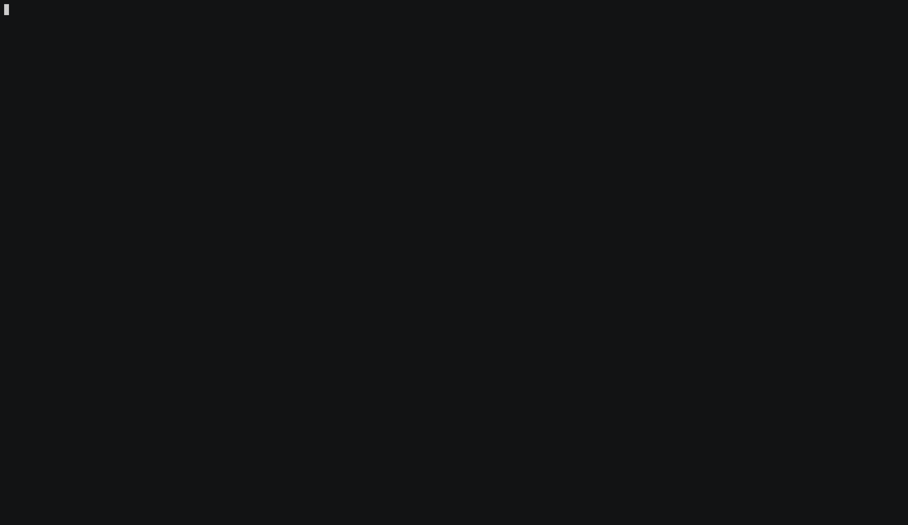

# ffcss



[](https://wakatime.com/badge/github/ewen-lbh/ffcss)

[](https://pkg.go.dev/github.com/ewen-lbh/ffcss)


A CLI interface to apply and configure [Firefox CSS themes](https://reddit.com/r/FirefoxCSS) (also known as userChrome.css themes).

It uses a YAML file to declare files, variants, helper addons and others. This file is referred to as a "manifest".

## Installation

### AUR

Arch Linux users can install the package through the AUR:

```
yay -S ffcss # latest release
# COMING SOON yay -S ffcss-git # latest commit
# COMING SOON yay -S ffcss-bin # pre-compiled binary of latest release
```

### Pre-compiled binary 

#### Linux & MacOS

_Make sure there isn't a folder called “installation” in your working directory_

```sh
# Don’t pollute your current directory
mkdir installation; cd installation
# Install the latest release by downloading the binary on Github
wget https://github.com/ewen-lbh/ffcss/releases/latest/download/YOUR-OS-64bit.tar.gz -O ffcss.tar.gz # replace YOUR-OS with linux or macos. There's also a 32bit version (386 instead of amd64)
# Extract it
tar -xzvf ffcss.tar.gz
# Install built-in themes
mkdir -p ~/.config/ffcss/themes/
cp -v themes/*.yaml ~/.config/ffcss/themes/
# Make sure the file is marked as executable
chmod +x ffcss
# Move it to a folder that’s in your path (so you can type `ffcss` anywhere), eg.
mv ffcss ~/.local/bin/ffcss
# Remove the extracted contents (you don’t need them anymore)
cd ..; rm -I -rf installation
```

#### Windows

(Assuming your user folder is at `C:\Users\you`)

1. Download the zip file: https://github.com/ewen-lbh/ffcss/releases/latest/download/windows-64bit.zip
1. Extract it somewhere, let's say in `C:\Users\you\Desktop\ffcss`.
1. Open that folder in the Explorer
1. Right-click on empty space and select "Open Windows Terminal Here"
1. Type `.\ffcss.exe`
1. Copy `C:\Users\you\Desktop\ffcss\themes` to `C:\Users\you\.config\ffcss`

To use ffcss, you can run that `ffcss.exe` in the Windows Terminal

### Compile it yourself

_instructions for linux & MacOS, I haven't figured out how to run `make` on Windows, winget installs it but the command is still 'not found'..._

```sh
git clone https://github.com/ewen-lbh/ffcss
cd ffcss
make 
make tests # optional, to make sure everything works
make install
```

## Usage

```docopt
ffcss - Apply and configure FirefoxCSS themes

Usage:
	ffcss [options] use THEME_NAME [VARIANT]
	ffcss [options] get THEME_NAME
	ffcss [options] cache clear
	ffcss [options] init
	ffcss [options] reapply
	ffcss version [COMPONENT]

Where:
	THEME_NAME  a theme name or URL (see README.md)
	COMPONENT   is either major, minor or patch (to get a single digit)

Options:
	-a --all-profiles           Apply the theme to all profiles
	-p --profiles=PATHS      Select which profiles to apply the theme to.
	                         Can be absolute or relative to --profiles-dir.
							 Comma-separated.
	--profiles-dir=PATH      Directory that contains profile directories.
	                         Default value is platform-specific:
	                         - $HOME/.mozilla/firefox                                on Linux
	                         - $HOME/Library/Application Support/Firefox/Profiles    on MacOS
	                         - %appdata%/Roaming/Mozilla/Firefox/Profiles            on Windows
	--skip-manifest-source   Don't ask to show the manifest source
```

#### The `use` command

Synopsis: `ffcss use THEME_NAME [VARIANT_NAME]`

ffcss will first search for a folder at `~/.cache/ffcss/THEME_NAME/VARIANT_NAME`. If not found, it will try to download the theme:


If `THEME_NAME` is of the form `OWNER/REPO`:

- It'll use the repository `github.com/OWNER/REPO`
  
If `THEME_NAME` is of the form `NAME`:

- It'll search for `NAME` in the manifests included with ffcss (see [Built-in themes](#built-in-themes))

The `NAME` here is insensitive to case, whitespace, punctuation (`.`, ` `, `_` and `-`) and unicode ([NFD normalization](http://www.macchiato.com/unicode/nfc-faq) is applied before searching). 

That means that typing `ffcss use FrozenFox` will work even if the theme's manifest is stored in `frozenfox.yaml`, and not `FrozenFox.yaml`.

And if `THEME_NAME` is an URL:

- It'll download the zip file / clone the git repository at `THEME_NAME` (the `https://` part can be omitted)

_Technical note: when no variant is used, `VARIANT_NAME` is "\_"_

<!-- ### The `config` command

Synopsis: `ffcss config KEY [VALUE]`

Much simpler than the `use` command, this one just adds convenience to set `about:config` keys. If `VALUE` is not provided, ffcss will output the specified `KEY`'s current value. -->

### The `reapply` command

Synopsis: `ffcss reapply`

This is the same as doing `ffcss use` with the current theme, useful when firefox updates.

The current theme for each profile is stored in ffcss' configuration folder, in `currently.yaml`

### The `get` command

This is the same as running `use`, but does not actually apply the theme, it just downloads it to the cache.

### The `cache clear` command

Clears the ffcss cache, including all downloaded themes.

### The `init` command

Synopsis: `ffcss init`

Creates a [`ffcss` manifest file](#creating-a-firefoxcss-theme) in the current directory

## What if the theme I want to download has no manifest?

You can create one for yourself, by placing it in `<home folder>/.config/ffcss/<your theme's name>.yaml`, along with the other included themes, then running `ffcss use` with that name.

Consider opening a pull request if you can, so that others can benefit from your manifest without having to write it again.

The next section covers how to create that manifest file. It is written for theme makers, but the only difference is that the manifest you wrote isn't named `ffcss.yaml`.

## Creating a FirefoxCSS theme

So that your users can benefit from the simple installation process provided by ffcss, you can add a `ffcss.yaml` file in the root of your project and declare additional configuration you might need. 

_Note: example use cases from real FirefoxCSS themes are given for illustrative purposes, and I don't claim to speak in place of the theme's author(s), even if it may appear as so_.

You can start by using `ffcss init` in your theme's folder, some values will be filled automatically.


### Download

You can specify in your manifest file from where to download the theme.
This can be useful if

- you want to use that value in `variants`, to download a different zip file
- you want to [add your manifest to the registry](#add-to-the-registry), in which case the repository's URL is needed for ffcss to figure out where to download your theme from
- you want users to download a zip file instead of cloning your repo

### Branch, Tag & Commit

If you use a git repository URL (ffcss will know if any given URL is `git-clone`-able), you can also use these three to:

- change the branch used (`branch: <the branch's name>`)
- change the commit used (`commit: <the commit's SHA>`)
- change the tag used (`tag: <the git tag's name>`)

Here again, this is especially useful for variants (for example, Lepton's photon-style variant is on a separate branch `photon-style`)

### Config

An object mapping `about:config` configuration keys to their values:

```yaml
config:
    svg.context-properties.content.enabled: true
    security.insecure_connection_text.enabled: true
```

Note that `toolkit.legacyUserProfileCustomizations.stylesheets` is set to `true` automatically, no need to declare it.

This will write a generated `user.js` file in the selected profile directory (or directories).
If you provide your own `user.js` file, the generated content will be appended to yours and written on the same file.

### Files

You can use `userChrome`, `userContent` and `user.js` keys to specify where those files are in your repo. You can use [glob patterns][globster].

They will get copied to `<selected profile directory>/chrome/userChrome.css` (or `userContent.css`) and `<selected profile directory>/user.js>`, respectively.

Note that even if _your_ file is not called like this, if will get copied with that name, no manual renaming required.

For example, SimplerentFox uses three different `userContent.css` files for its variants, and the manifest has `{{ os }}/userContent__{{ variant }}.css`.

<!--If not specified, their default values are either `userChrome.css` (or `userContent.css`, or `user.js`) or `null` when the default file is not found.-->

You can also declare other files in `assets`, an array of [glob patterns][globster]. They take precedence over the others keys, since they get copied last.

You can use `{{ os }}`, which will get replaced with one of `windows`, `linux` or `macos`, and `{{ variant }}`, which will get replaced by the variant the user has chosen.


All files will get copied to `<user's profile folder>/chrome/`. You can change the from where they get copied with `copy from`.
This is pretty useful if you store your assets inside a folder (such as `chrome`), to avoid them being nested too much

```yaml
assets: 
    - my-assets/**
copy from: my-assets/ 
```

without the `copy from`, files would get copied to `<user's profile folder>/chrome/my-assets/...` instead of `<user's profile folder>/chrome/...`: `my-assets/` will be a part of the file names described by `my-assets/**`.

For example, MaterialFox stores everything under `chrome/`, and its manifest uses `copy from: chrome/` to tell ffcss to copy assets _from that directory_, not from the repository's root.

[globster]: https://globster.xyz

### Variants

Some themes allow users to choose between different variations. To declare them, add an object with key `variants`, that maps variant names to a configuration object, overriding `config`, `userContent`, etc. for that variation. <!--An additional `description` key is available and will be shown to users when selecting a variant.-->

Note that overriding `config` only overrides values set, it does not remove configuration keys that have been set globally: with the following manifest:

```yaml
ffcss: 1 # signals that the manifest works with ffcss versions 1.X.X

config:
    one.property: yes
    another.property: buckaroo

variants:
    blue:
        config:
            one.property: false
```

choosing the variant "blue" will apply the following config:

```yaml
one.property: false
another.property: buckaroo
```

Properties that can be overriden are:

- repository 
- branch
- tag
- commit
- config
- userChrome
- userContent
- user.js
- assets
- addons
- run
- description


For example, SimplerentFox proposes an addon to enhance the experience, and declares it as such:

```yaml
...

addons:
    - https://addons.mozilla.org/en-US/firefox/addon/simplerentfox/

...
```

### Running custom commands

You can run any shell command after and/or before the installation, with the manifest entries `run`.`before` and `run`.`after`:

```yaml
run:
  before: echo hello from {{ profile_path }}!
  after: wget https://example.com/my-custom-file?version={{ firefox_version }}
```

In both values, `{{ profile_path }}` and `{{ firefox_version }}` will respectively get replaced with the path of the profile to which the theme is being installed, and that profile's firefox version.

### Messages

You can specify a message to be printed at the end of the installation. Markdown syntax is supported.

Useful to provide additional instructions that can't be automated, to suggest optional tweaks, to do shameless promotion or even just to say thanks! 

For example, VerticalTabs uses messages to tell users about additional installation steps that can't be automated:

```yaml
message: |
  Go to about:addons, select Tab Center Reborn, go to Preferences and set:

  - *Animations*: on.
  - *Use current browser theme*: on, if you want to use dark mode.
  - *Compact Mode*: either “Dynamic” or “Enabled”. It works with “Disabled” too but looks nicer with only favicons.
  - *Favicon-only pinned tabs*: off.
  - *Activate Custom Stylesheet* and paste the contents of tabCenterReborn.css into the text area, and click “Save CSS”.
```

### Description & By

Those two fields can be set to be displayed before the installation begins. Something like


```
Installing <name> by <by>

| <description>
```

Will then be shown to the user when starting the installation

### Declaring ffcss' version

Putting a `ffcss: 0` in your manifest tells the user that this theme was made with ffcss version 0.X.X. 
If their version differs, they'll get a warning: major version changes (i.e. when the leftmost number changes) may include _breaking changes_ regarding the manifest file, which means that your theme might not work.

I'll try to not do that though, it sucks to break things. (I may support _different versions of manifest files_, at least)

### Declaring supported Firefox versions

The manifest entry `firefox` can be used to specify which versions of Firefox are compatible with your theme.

Users that have a non-compatible Firefox version will be shown a warning.

The following patterns can be used:

- `<version>` - compatible with that version only.

    For example:

    ```yaml
    firefox: 90
    ```
- `<A>-<B>` - compatible with every version from _A_ to _B_ (including both _A_ and _B_)

    For example:

    ```yaml
    firefox: 86-90
    ```

- `<A>+` - compatible with version _A_ or more recent 

    For example:

    ```yaml
    firefox: 90+
    ```

- `up to <A>` - compatible with every version, up to _A_ (including _A_)

    For example:

    ```yaml
    firefox: up to 88
    ```

Note that you can also be more precise and specify the minor part (the second digit after the dot), for example `firefox: 90.5+`.

### Examples

You can look at some themes' manifests in `themes/*.yaml` to see how they are written.

## Built-in themes

The following themes are provided with ffcss, you can install them with `ffcss use <theme's name>`.

- [alpenblue](https://github.com/Godiesc/AlpenBlue) by [Godiesc](https://github.com/Godiesc)
- [australis-tabs](https://github.com/sagars007/Australis-like-tabs-FF-ProtonUI-changes) by [sagars007](https://github.com/sagars007)
- [blurredfox](https://github.com/manilarome/blurredfox) by [manilarome](https://github.com/manilarome)
- [chameleons-beauty](https://github.com/Godiesc/Chameleons-Beauty) by [Godiesc](https://github.com/Godiesc)
- [compactmode](https://github.com/Godiesc/compactmodefirefoxcss) by [Godiesc](https://github.com/Godiesc)
- [diamondfucsia](https://github.com/Godiesc/DiamondFucsia) by [Godiesc](https://github.com/Godiesc)
- [frozenfox](https://github.com/tortious/FrozenFox) by [tortious](https://github.com/tortious)
- [fxcompact](https://github.com/dannycolin/fx-compact-mode) by [dannycolin](https://github.com/dannycolin)
- [halo](https://github.com/seirin-blu/Firefox-Halo) by [seirin-blu](https://github.com/seirin-blu)
- [lepton](https://github.com/black7375/Firefox-UI-Fix) by [black7375](https://github.com/black7375)
- [martinfox](https://github.com/arp242/MartinFox) by [arp242](https://github.com/arp242)
- [materialfox](https://github.com/muckSponge/MaterialFox) by [muckSponge](https://github.com/muckSponge)
- [modoki](https://github.com/soup-bowl/Modoki-FirefoxCSS) by [soup-bowl](https://github.com/soup-bowl)
- [montereyfox](https://github.com/FirefoxCSSThemers/Monterey-Fox) by [FirefoxCSSThemers](https://github.com/FirefoxCSSThemers)
- [pro-fox](https://github.com/xmansyx/Pro-Fox) by [xmansyx](https://github.com/xmansyx)
- [proton-connected-rounded-tabs](https://github.com/sagars007/Proton-UI-connected-rounded-tabs) by [sagars007](https://github.com/sagars007)
- [simplerentfox](https://github.com/MiguelRAvila/SimplerentFox) by [MiguelRAvila](https://github.com/MiguelRAvila)
- [technetium](https://github.com/edo0/Technetium) by [edo0](https://github.com/edo0)
- [verticaltabs](https://github.com/ranmaru22/firefox-vertical-tabs) by [ranmaru22](https://github.com/ranmaru22)
- [wavefox](https://github.com/QNetITQ/WaveFox) by [QNetITQ](https://github.com/QNetITQ)

### Add to registry

You can add your theme to this list, just fork the repository, copy your `ffcss.yaml` theme as `themes/<your theme's name>.yaml`, and submit a PR!
